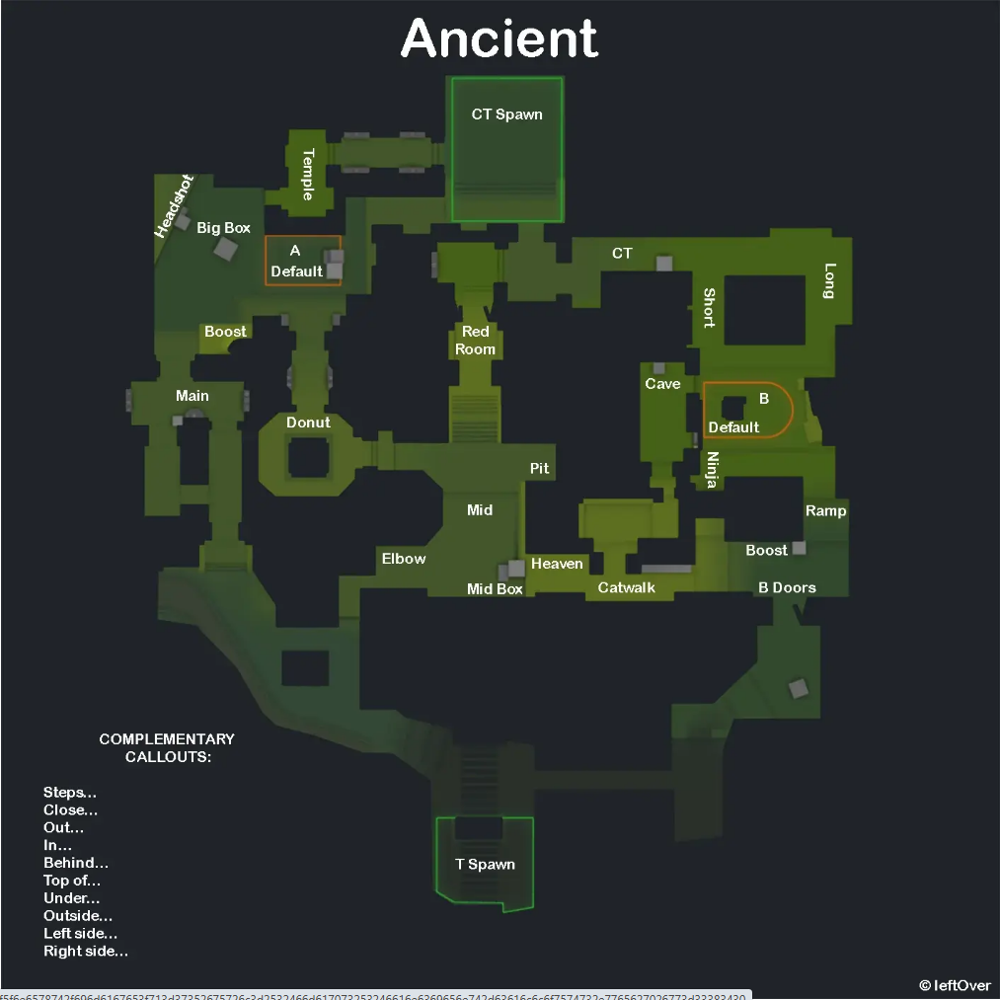
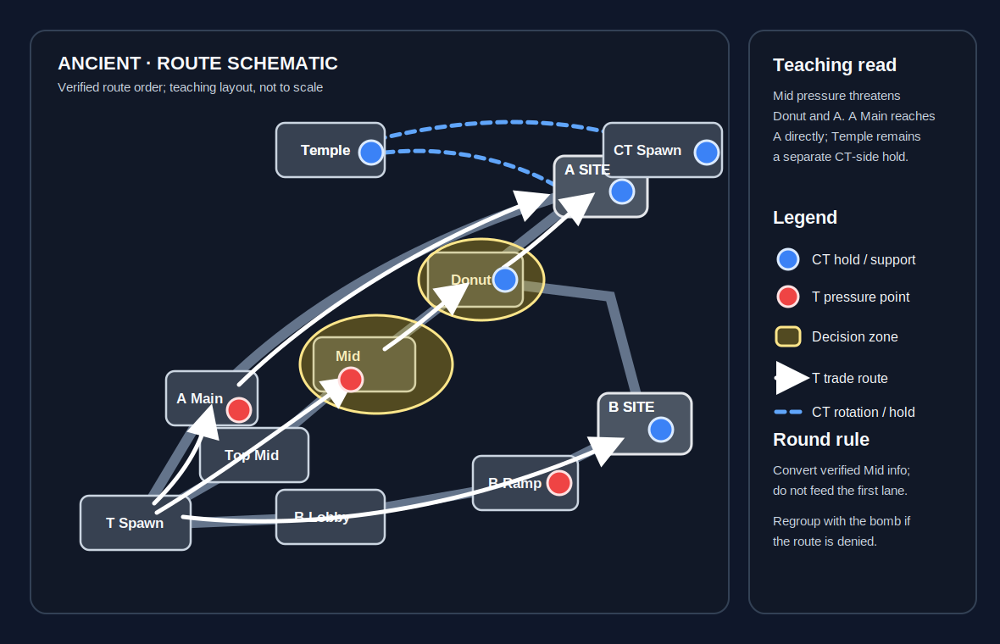
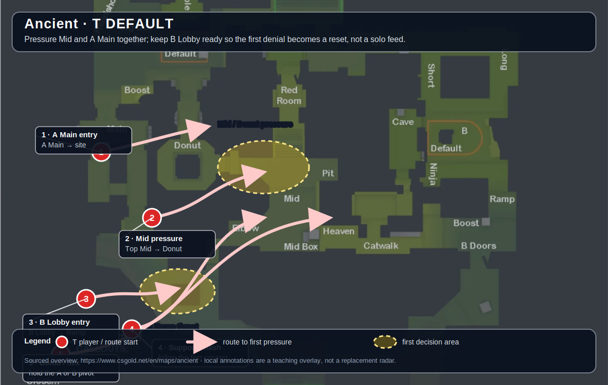
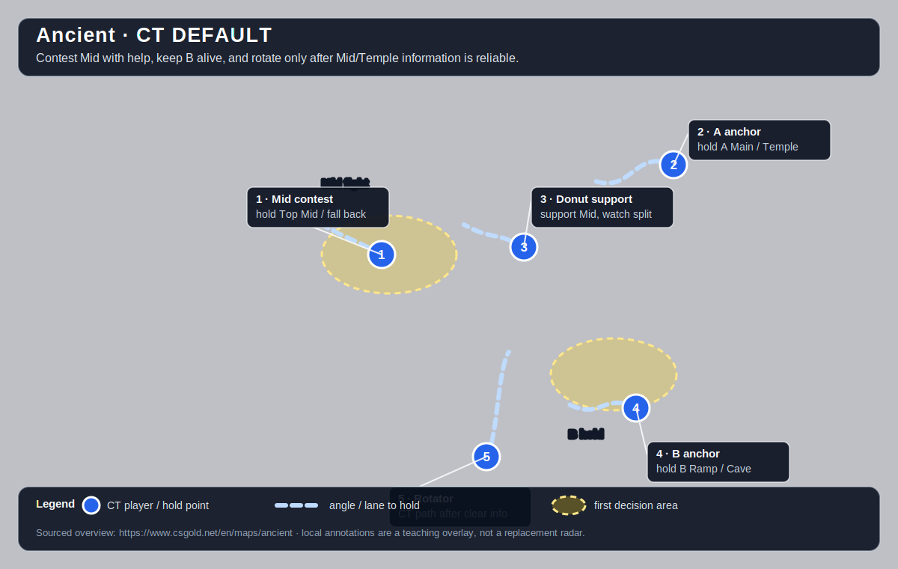

# Ancient

[Open the interactive Ancient web companion](https://chilldebrand.github.io/CS2-Guide/maps/ancient/)

**Pool:** Premier / Active Duty  
**Mode:** Defusal  
**Key lesson:** Mid control and lane isolation

[Visual/source note](assets/map-overview-source.md)

## Positioning visual

[Positioning source note](assets/map-overview-source.md) · [Visual utility cards](utility.md#visual-lineups)

1. Starting roles: Ts keep two players near Mid, one at A Main, one at B Lobby, and one flexible support; CTs keep an A anchor, a B anchor, and a Mid helper without exposing every lane.
2. Information trigger: confirmed Mid or Donut control can turn into an A split, while denied Mid pressure is the signal to preserve the bomb and regroup toward the opposite lane.
3. Rotation/trade path: the route arrows show Mid into Donut/A, A Main into A, and B Lobby into B; CT help moves only after reliable Mid, Temple, or B information.

## How to use this folder

- [Offense plan](offense.md)
- [Defense plan](defense.md)
- [Utility priorities](utility.md)
- [Visual utility cards](utility.md#visual-lineups)

## Win condition

Own enough Mid/Donut information to make A and B defenders choose which lane to give up.

## Learn first

1. Learn the common callouts and the two safest routes to the objective.
2. Play the simple default in the offense file for five rounds before changing it.
3. Practice the utility targets with a teammate who knows the follow-up.

## Five-player defaults

These are opening-role overlays over the supplied Ancient callout map photo. T Spawn is bottom-center: use the T diagram to assign routes and initial pressure; use the CT diagram to assign hold angles and the first rotation trigger. They are teaching overlays, not pixel-perfect radars.

### T-side default

Keep the first route close enough to trade. If the pressure point is denied, preserve the bomb and regroup rather than feeding another isolated fight.

### CT-side default

Call location, number, and direction before rotating. Hold the shown lane until reliable information changes the job.

[Five-player overlay source note](assets/map-overview-source.md)
