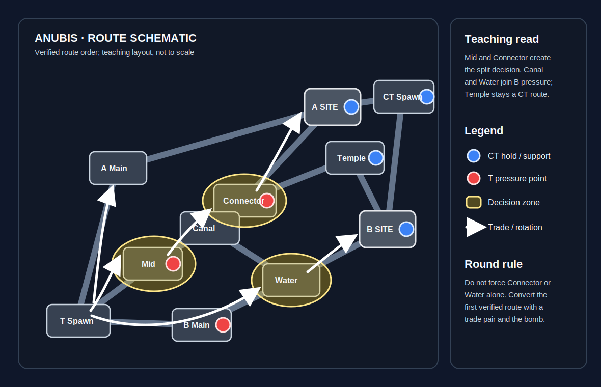
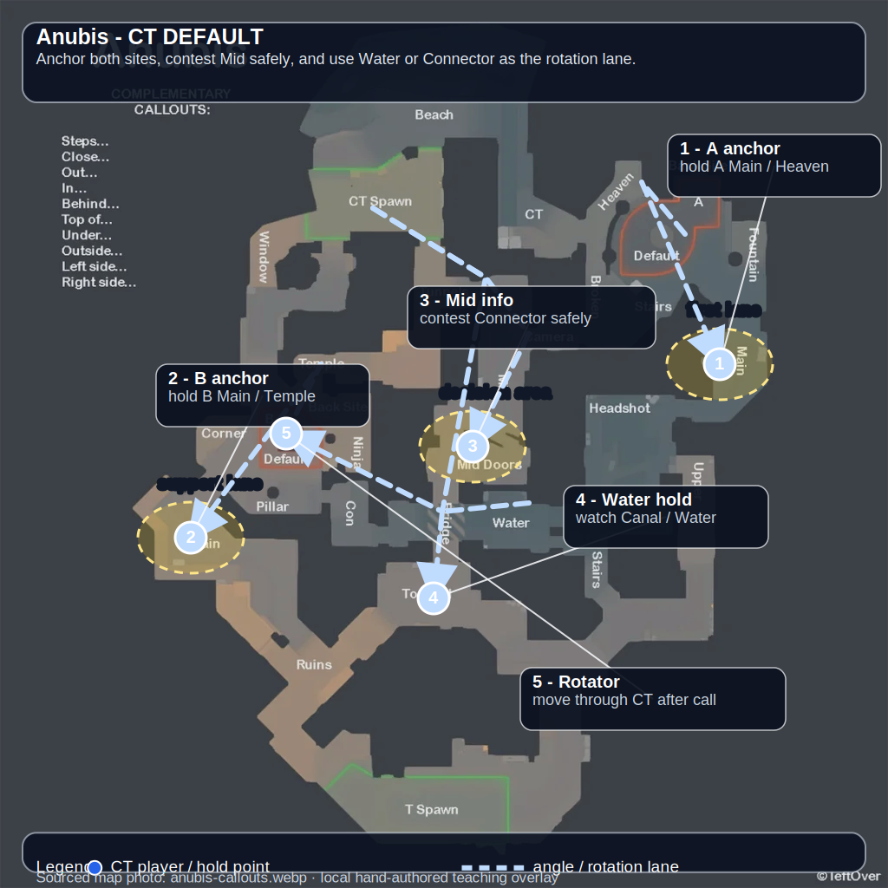

# Anubis

[Open the interactive Anubis web companion](https://chilldebrand.github.io/CS2-Guide/maps/anubis/)

**Pool:** Premier / Active Duty  
**Mode:** Defusal  
**Key lesson:** Mid/Connector access, Water/Canal pressure, and split timing

[Visual/source note](assets/map-overview-source.md)

## Positioning visual

[Positioning source note](assets/map-overview-source.md) · [Visual utility cards](utility.md#visual-lineups)

1. Starting roles: Ts keep two players around Mid/Connector, one A Main player, one B Main player, and one flexible bomb carrier; CTs preserve Mid information while keeping both site anchors tradeable.
2. Information trigger: a covered Connector opens the split decision, while confirmed Water or Canal pressure tells the B anchor to call support instead of taking an isolated first fight.
3. Rotation/trade path: the arrows show Mid into Connector, Canal into Water, and the direct A Main/B Main entries; the Temple route remains a CT rotation lane until utility or contact confirms it is isolated.

## How to use this folder

- [Offense plan](offense.md)
- [Defense plan](defense.md)
- [Utility priorities](utility.md)
- [Visual utility cards](utility.md#visual-lineups)

## Win condition

Take a Connector or Water route that forces the defense to fight from multiple directions.

## Learn first

1. Learn common callouts and safe routes.
2. Play the default for five rounds before changing it.
3. Practice the utility targets with a teammate.
4. Review one spacing or timing error after the match.

## Five-player defaults

These are opening-role overlays over the sourced map overview. Use the T diagram to assign routes and initial pressure; use the CT diagram to assign hold angles and the first rotation trigger. They are teaching overlays, not pixel-perfect radars.

### T-side default

Keep the first route close enough to trade. If the pressure point is denied, preserve the bomb and regroup rather than feeding another isolated fight.

### CT-side default

Call location, number, and direction before rotating. Hold the shown lane until reliable information changes the job.

[Five-player overlay source note](assets/map-overview-source.md)
