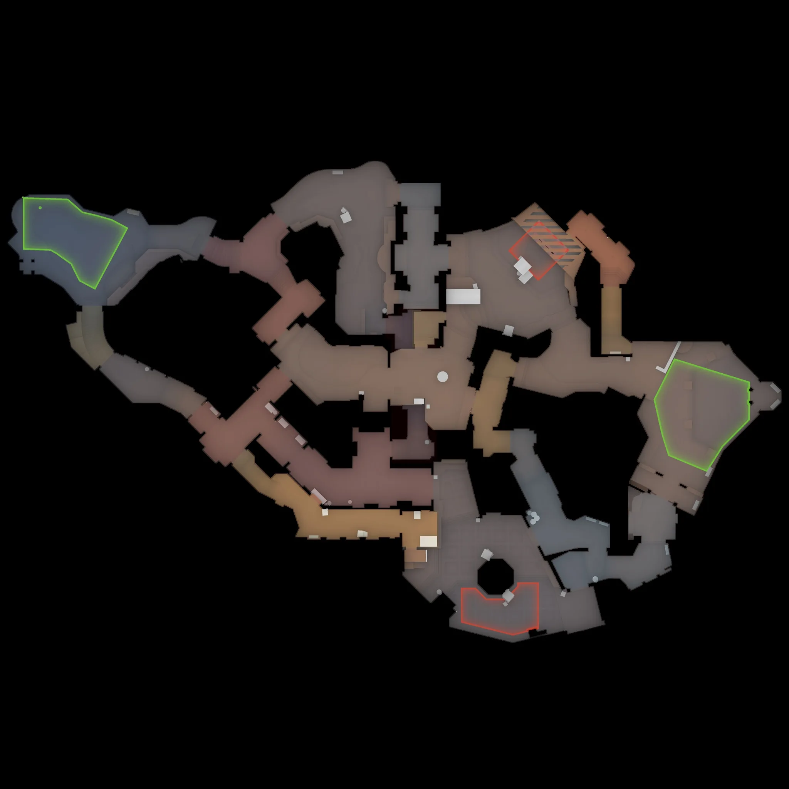

# Boulder

**Pool:** Competitive-only  
**Mode:** Defusal  
**Key lesson:** Learning a new community layout and controlling its central routes

[Visual/source note](assets/map-overview-source.md)

## Positioning visual status

The sourced overhead supports the authored five-player route and hold overlays below. Use the creator's [Boulder Steam Workshop page](https://steamcommunity.com/sharedfiles/filedetails/?id=3663186989) for current build updates.

[Geometry/source note](assets/map-overview-source.md) · [Pending visual utility cards](utility.md#visual-lineups)

1. Starting roles: use Mid pressure, A Long, B Short, Tunnels, and a flex bomb carrier as the opening five-player default.
2. Information trigger: use only confirmed central-route contact; no named connection or rotation is asserted by a local diagram.
3. Rotation/trade path: keep A Long and B Short separate until Mid or Connector information makes the site call clear.

## How to use this folder

- [Offense plan](offense.md)
- [Defense plan](defense.md)
- [Utility priorities](utility.md)
- [Pending visual utility cards](utility.md#visual-lineups)

## Win condition

Accurate callouts and simple two-player clears matter more than complicated playbooks on a newer community map.

## Learn first

1. Learn common callouts and safe routes.
2. Play the default for five rounds before changing it.
3. Practice the utility targets with a teammate.
4. Review one spacing or timing error after the match.
