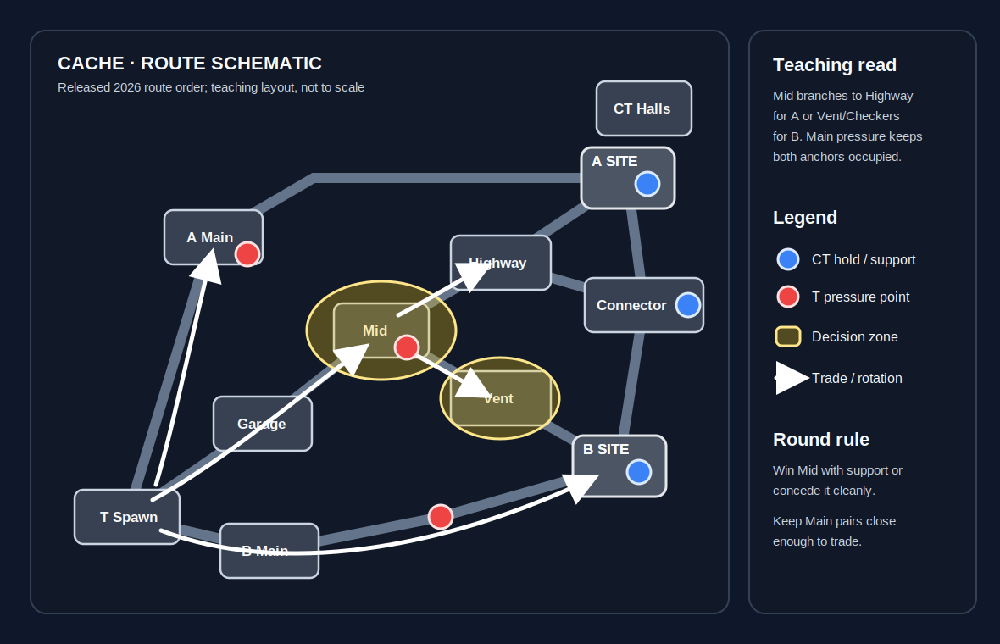

# Cache

**Pool:** Premier / Active Duty  
**Mode:** Defusal  
**Key lesson:** Mid, vents, and timing-based site pressure

[Visual/source note](assets/map-overview-source.md)

## Positioning visual

[Positioning source note](assets/map-overview-source.md) · [Visual utility cards](utility.md#visual-lineups)

1. Starting roles: Ts open with A Main and B Main presence, two Mid/Garage players, and a flexible bomb carrier; CTs keep site anchors while the Mid player preserves a Connector retreat.
2. Information trigger: won Mid space opens Highway toward A or Vent toward Checkers/B; if Mid is denied, the Main players hold tradeable spacing instead of entering alone.
3. Rotation/trade path: the route arrows show the Mid branches through Highway and Vent, plus the direct A Main and B Main entries; CT support moves through Connector or CT Halls after the site call is reliable.

## How to use this folder

- [Offense plan](offense.md)
- [Defense plan](defense.md)
- [Utility priorities](utility.md)
- [Visual utility cards](utility.md#visual-lineups)

## Win condition

Make Mid and vents valuable so defenders cannot hold both A Main and B Main comfortably.

## Learn first

1. Learn common callouts and safe routes.
2. Play the default for five rounds before changing it.
3. Practice the utility targets with a teammate.
4. Review one spacing or timing error after the match.
