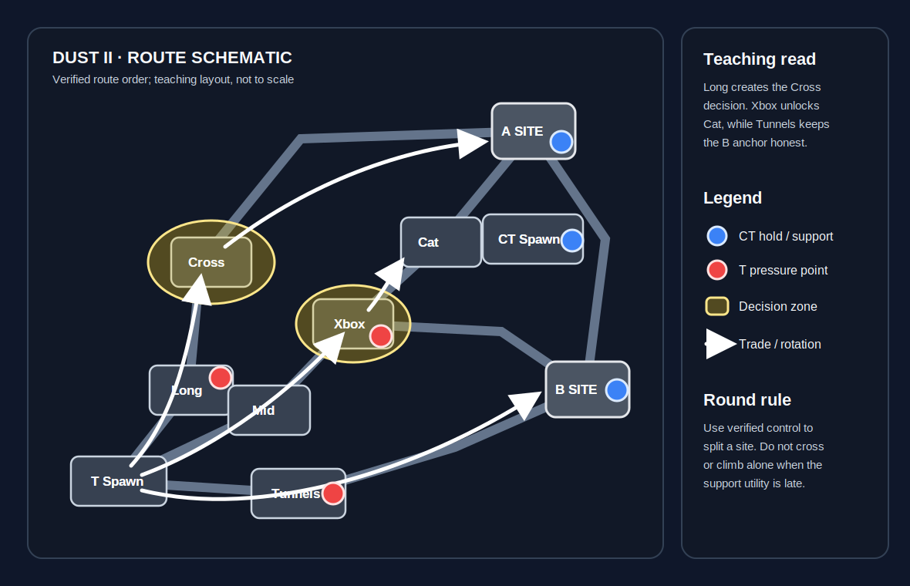

# Dust II

**Pool:** Premier / Active Duty  
**Mode:** Defusal  
**Key lesson:** Long/Mid control, Cat timing, and tradeable fights

[Visual/source note](assets/map-overview-source.md)

## Positioning visual

[Positioning source note](assets/map-overview-source.md) · [Visual utility cards](utility.md#visual-lineups)

1. Starting roles: Ts open with two toward Long, two around Mid/Short, and one B Tunnel player; CTs either contest Long with support or concede it while preserving Mid and B information.
2. Information trigger: Long control creates the Cross decision, while an Xbox smoke creates the Cat route; confirmed Tunnel pressure is the signal for the B anchor to call help rather than fight alone.
3. Rotation/trade path: the arrows show Long into A, Mid through Xbox/Cat into A, and Tunnels into B; CT rotations use CT/Short only after a reliable call.

## How to use this folder

- [Offense plan](offense.md)
- [Defense plan](defense.md)
- [Utility priorities](utility.md)
- [Visual utility cards](utility.md#visual-lineups)

## Win condition

Win Long or Mid information without donating isolated kills, then convert the space into a site split.

## Learn first

1. Learn common callouts and safe routes.
2. Play the default for five rounds before changing it.
3. Practice the utility targets with a teammate.
4. Review one spacing or timing error after the match.
