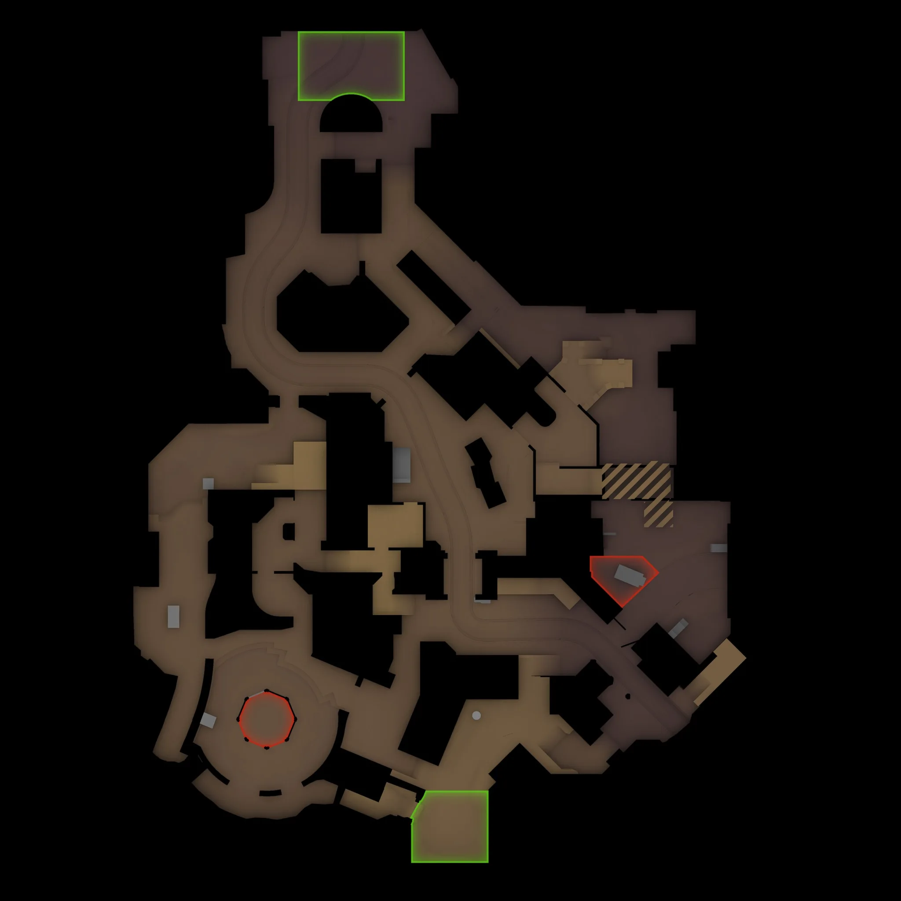

# Fachwerk

**Pool:** Competitive-only  
**Mode:** Defusal  
**Key lesson:** Long streets mixed with close indoor fights

[Visual/source note](assets/map-overview-source.md)

## Positioning visual status

The sourced overhead supports the authored five-player route and hold overlays below. Recheck the [Fachwerk Steam Workshop page](https://steamcommunity.com/sharedfiles/filedetails/?id=3442040035) after creator-build updates.

[Geometry/source note](assets/map-overview-source.md) · [Pending visual utility cards](utility.md#visual-lineups)

1. Starting roles: use A Main, A Apps, Mid/Connector, B Main, and a short split as the opening five-player default.
2. Information trigger: confirm the outdoor-to-indoor transition in the installed build before calling a route clear or rotating a defender.
3. Rotation/trade path: keep A Main and B Main separate until Mid/Connector information makes the site call clear.

## How to use this folder

- [Offense plan](offense.md)
- [Defense plan](defense.md)
- [Utility priorities](utility.md)
- [Pending visual utility cards](utility.md#visual-lineups)

## Win condition

Learn the official callouts, then use indoor/outdoor transitions to force awkward defender fights.

## Learn first

1. Learn common callouts and safe routes.
2. Play the default for five rounds before changing it.
3. Practice the utility targets with a teammate.
4. Review one spacing or timing error after the match.
