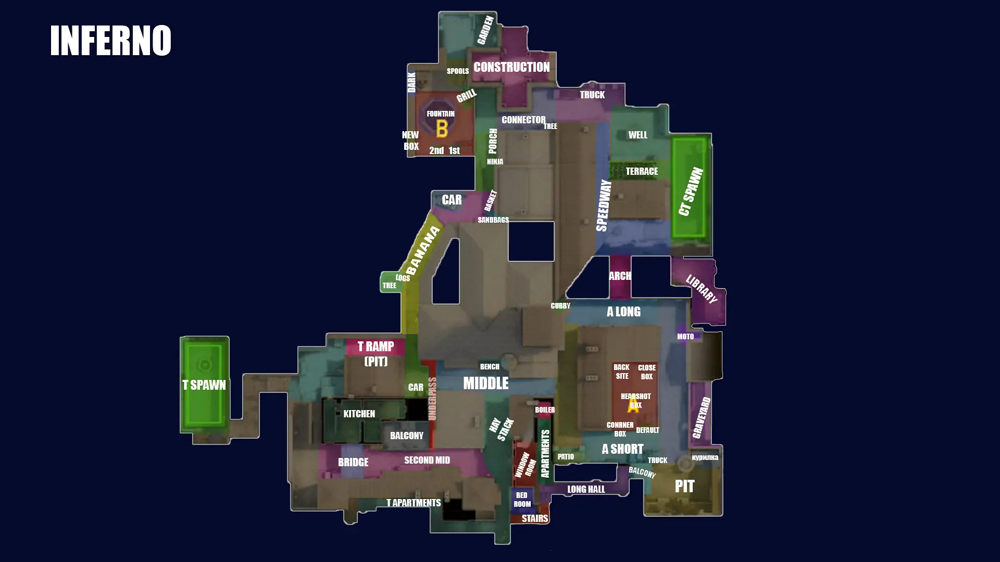
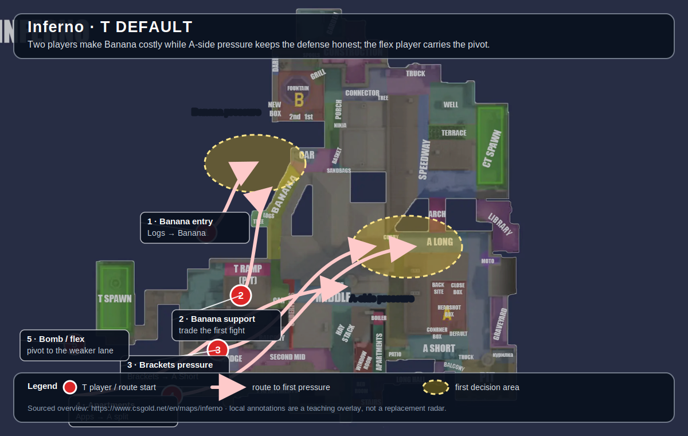
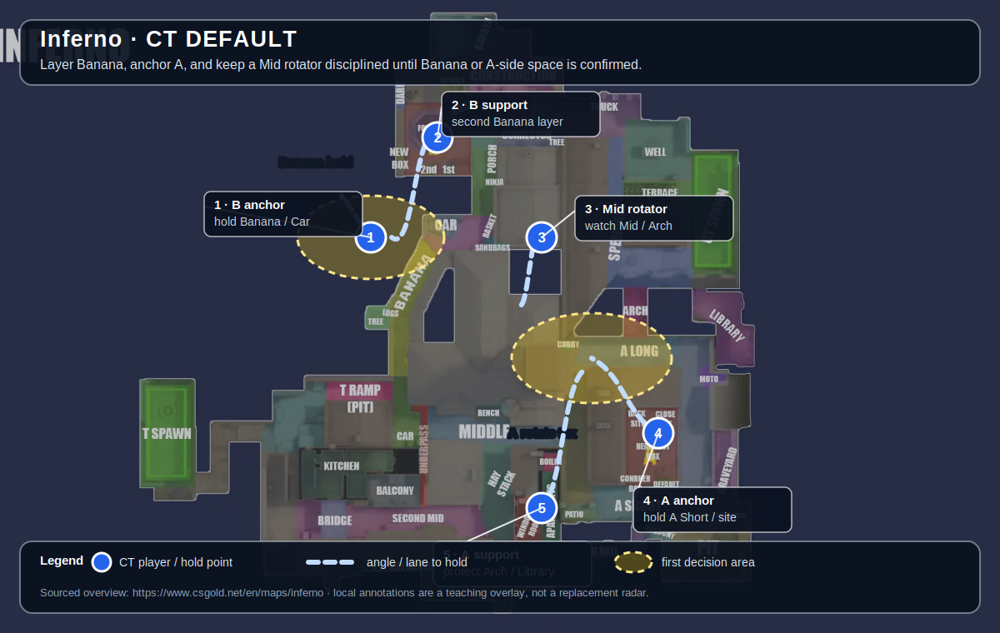

# Inferno

[Open the interactive Inferno web companion](https://chilldebrand.github.io/CS2-Guide/maps/inferno/)

**Pool:** Premier / Active Duty  
**Mode:** Defusal  
**Key lesson:** Banana control, Brackets pressure, and rotation discipline

[Visual/source note](assets/map-overview-source.md)

## How to use this folder

- [Offense plan](offense.md)
- [Defense plan](defense.md)
- [Utility priorities](utility.md)

## Win condition

Make Banana or Apartments expensive to contest, then use the rotation pressure to isolate the other site.

## Learn first

1. Learn common callouts and safe routes.
2. Play the default for five rounds before changing it.
3. Practice the utility targets with a teammate.
4. Review one spacing or timing error after the match.

## Five-player defaults

These are opening-role overlays over the sourced map overview. Use the T diagram to assign routes and initial pressure; use the CT diagram to assign hold angles and the first rotation trigger. They are teaching overlays, not pixel-perfect radars.

### T-side default

Keep the first route close enough to trade. If the pressure point is denied, preserve the bomb and regroup rather than feeding another isolated fight.

### CT-side default

Call location, number, and direction before rotating. Hold the shown lane until reliable information changes the job.

[Five-player overlay source note](assets/map-overview-source.md)
