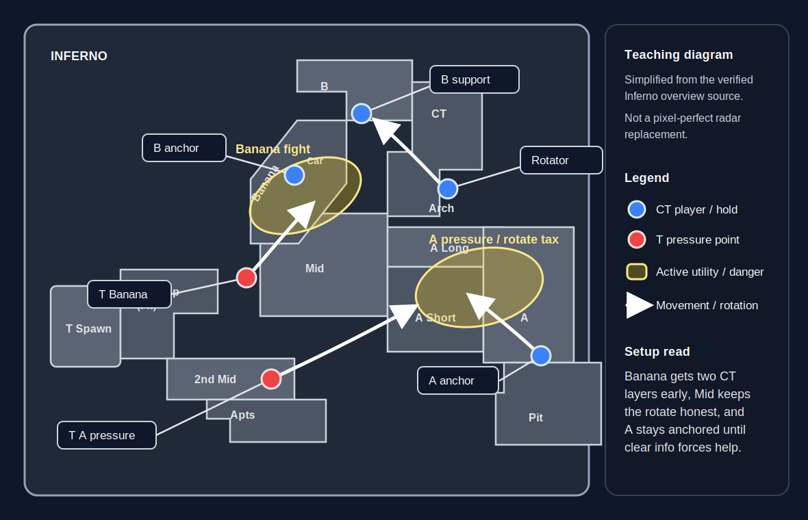

# Inferno

**Pool:** Premier / Active Duty  
**Mode:** Defusal  
**Key lesson:** Banana control, Brackets pressure, and rotation discipline

[Visual/source note](assets/map-overview-source.md)

## Positioning visual

[Positioning source note](assets/map-overview-source.md)

1. Starting roles: CTs open with a Banana anchor and support, one A anchor, and one Mid rotator while Ts show pressure at Banana and on the A-side route instead of revealing a full commit.
2. Information trigger: the yellow Banana fight zone is the first major decision point; CTs should not over-rotate on one footstep, but confirmed Banana commitment or clean A-side space changes the rotator's job.
3. Rotation/trade path: the white arrows show the main responses from T pressure into Banana or A Short and from the CT rotator or A anchor into the trade path once the call is clear.

## How to use this folder

- [Offense plan](offense.md)
- [Defense plan](defense.md)
- [Utility priorities](utility.md)

## Win condition

Make Banana or Apartments expensive to contest, then use the rotation pressure to isolate the other site.

## Learn first

1. Learn common callouts and safe routes.
2. Play the default for five rounds before changing it.
3. Practice the utility targets with a teammate.
4. Review one spacing or timing error after the match.
