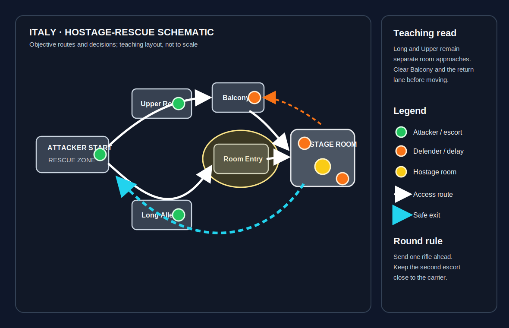

# Italy

**Pool:** Competitive-only  
**Mode:** Hostage  
**Key lesson:** tight alleys, balcony access, and rescue routes

[Visual/source note](assets/map-overview-source.md)

## Positioning visual

[Positioning source note](assets/map-overview-source.md) · [Visual utility cards](utility.md#visual-lineups)

1. Starting roles: attackers keep a Long Alley pair, an Upper Route pair, and a flexible escort; defenders split room security from return-lane delay so the first alley is not overstacked.
2. Information trigger: controlled room access and a checked balcony/return lane allow the carrier to move; uncertain upper information keeps the hostage inside while the escort clears the safe exit.
3. Rescue/trade path: Long Alley and Upper/Balcony remain separate approaches, then the forward rifle clears the return lane while the second escort protects the carrier toward the rescue zone.

## How to use this folder

- [Attacker plan](offense.md)
- [Defender plan](defense.md)
- [Utility priorities](utility.md)
- [Visual utility cards](utility.md#visual-lineups)

## Win condition

Attackers need controlled access to the hostage rooms; defenders need every rescue route to expose the carrier.

## Learn first

1. Learn the hostage-room callouts and the two safest approaches.
2. Keep the rescue carrier protected by a close escort.
3. Practice the room-entry flash and return-route smoke.
4. Review one failed rescue decision after the match.
