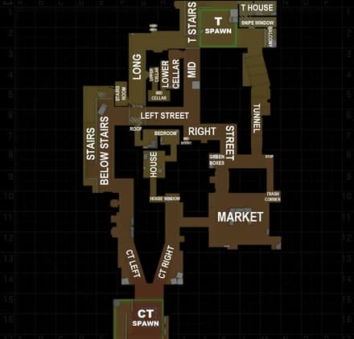

# Italy

**Pool:** Competitive-only  
**Mode:** Hostage  
**Key lesson:** tight alleys, balcony access, and rescue routes

[Visual/source note](assets/map-overview-source.md)

## How to use this folder

- [Attacker plan](offense.md)
- [Defender plan](defense.md)
- [Utility priorities](utility.md)
- [Visual utility cards](utility.md#visual-lineups)

## Win condition

Attackers need controlled access to the hostage rooms; defenders need every rescue route to expose the carrier.

## Learn first

1. Learn the hostage-room callouts and the two safest approaches.
2. Keep the rescue carrier protected by a close escort.
3. Practice the room-entry flash and return-route smoke.
4. Review one failed rescue decision after the match.
