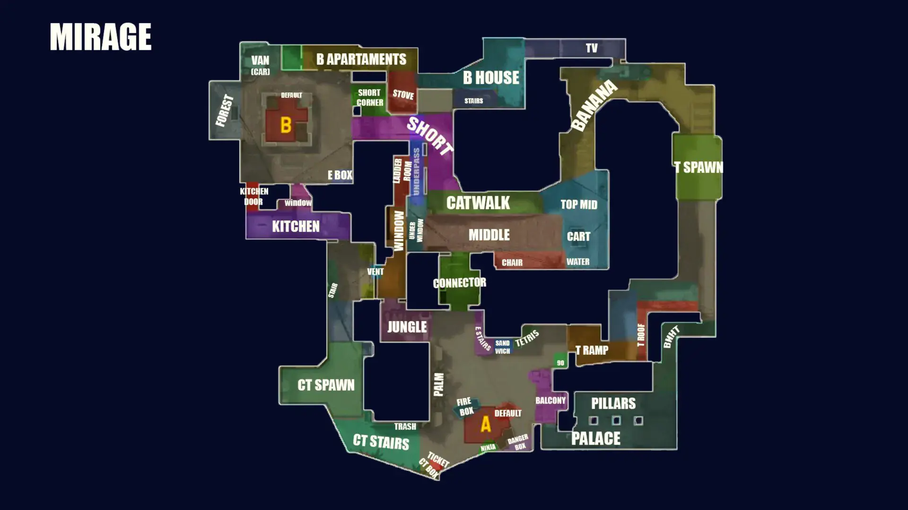

# Mirage

[Open the interactive Mirage web companion](https://chilldebrand.github.io/CS2-Guide/maps/mirage/)

**Pool:** Premier / Active Duty  
**Mode:** Defusal  
**Key lesson:** Mid information, Connector pressure, and site splits

[Visual/source note](assets/map-overview-source.md)

## How to use this folder

- [Offense plan](offense.md)
- [Defense plan](defense.md)
- [Utility priorities](utility.md)
- [Visual utility cards](utility.md#visual-lineups)

## Win condition

Use Mid to threaten both sites so defenders cannot hold A Ramp and B Apartments with full attention.

## Learn first

1. Learn common callouts and safe routes.
2. Play the default for five rounds before changing it.
3. Practice the utility targets with a teammate.
4. Review one spacing or timing error after the match.

## Five-player defaults

These are opening-role overlays over the sourced map overview. Use the T diagram to assign routes and initial pressure; use the CT diagram to assign hold angles and the first rotation trigger. They are teaching overlays, not pixel-perfect radars.

### T-side default

Keep the first route close enough to trade. If the pressure point is denied, preserve the bomb and regroup rather than feeding another isolated fight.

### CT-side default

Call location, number, and direction before rotating. Hold the shown lane until reliable information changes the job.

[Five-player overlay source note](assets/map-overview-source.md)
