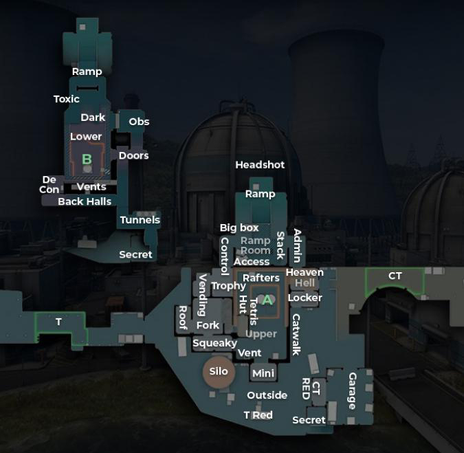
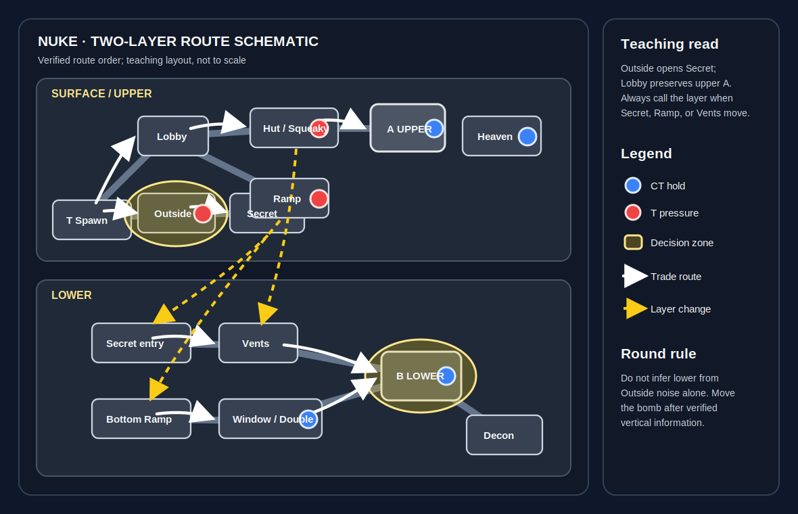
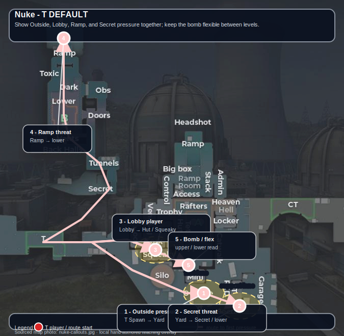
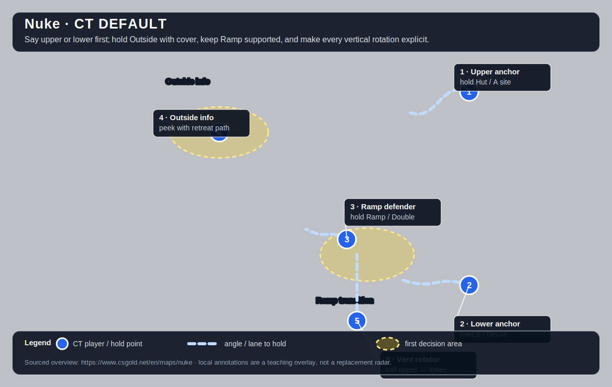

# Nuke

[Open the interactive Nuke web companion](https://chilldebrand.github.io/CS2-Guide/maps/nuke/)

**Pool:** Premier / Active Duty  
**Mode:** Defusal  
**Key lesson:** Outside information, vertical rotations, and lower-site control

[Visual/source note](assets/map-overview-source.md)

## Positioning visual

[Positioning source note](assets/map-overview-source.md) · [Visual utility cards](utility.md#visual-lineups)

1. Starting roles: Ts show Outside, Lobby, and Ramp pressure without separating the bomb from a trade pair; CTs preserve one upper anchor, one Outside watcher, and a Ramp player who can report movement to the lower layer.
2. Information trigger: an Outside smoke wall opens Secret, while a Ramp win or a Vent drop changes the call from upper pressure to lower control; every call includes the layer because identical horizontal callouts can be misleading.
3. Rotation/trade path: dashed arrows mark the verified vertical transitions from Secret, Ramp, and Vents into the lower layer; surface arrows retain the Lobby-to-A option so the team does not rush B on incomplete information.

## How to use this folder

- [Offense plan](offense.md)
- [Defense plan](defense.md)
- [Utility priorities](utility.md)
- [Visual utility cards](utility.md#visual-lineups)

## Win condition

Make defenders reveal upper/lower information, then use Outside, Ramp, or Lobby pressure to attack the weaker layer.

## Learn first

1. Learn common callouts and safe routes.
2. Play the default for five rounds before changing it.
3. Practice the utility targets with a teammate.
4. Review one spacing or timing error after the match.

## Five-player defaults

These are opening-role overlays over the sourced map overview. Use the T diagram to assign routes and initial pressure; use the CT diagram to assign hold angles and the first rotation trigger. They are teaching overlays, not pixel-perfect radars.

### T-side default

Keep the first route close enough to trade. If the pressure point is denied, preserve the bomb and regroup rather than feeding another isolated fight.

### CT-side default

Call location, number, and direction before rotating. Hold the shown lane until reliable information changes the job.

[Five-player overlay source note](assets/map-overview-source.md)
