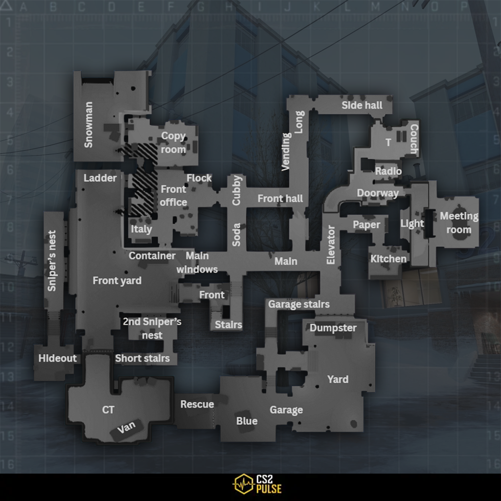
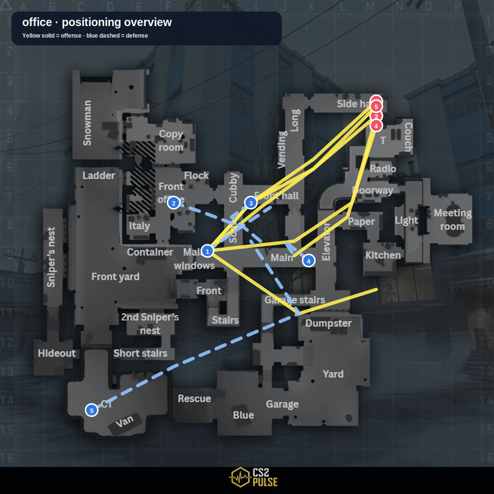

# Office

**Pool:** Competitive-only  
**Mode:** Hostage  
**Key lesson:** hostage-room access, long halls, and rescue timing

[Visual/source note](assets/map-overview-source.md)

## Positioning visual

[Positioning source note](assets/map-overview-source.md) · [Visual utility cards](utility.md#visual-lineups)

1. Starting roles: attackers keep a main-hall trade pair, a side-route pair, and a flexible escort; defenders isolate the hostage room with two tradeable angles and one rescue-route helper.
2. Information trigger: confirmed room access starts the rescue decision; if the return hall is not clear, the carrier waits while the escort checks the safe exit.
3. Rescue/trade path: main and side approaches converge only at the room, then the protected escort route returns through cleared halls to the rescue zone while defenders delay from a second angle instead of chasing.

## How to use this folder

- [Attacker plan](offense.md)
- [Defender plan](defense.md)
- [Utility priorities](utility.md)
- [Visual utility cards](utility.md#visual-lineups)

## Win condition

Attackers win by isolating the hostage room and escorting safely; defenders win by delaying the rescue and keeping crossfires intact.

## Learn first

1. Learn the hostage-room callouts and the two safest approaches.
2. Keep the rescue carrier protected by a close escort.
3. Practice the room-entry flash and return-route smoke.
4. Review one failed rescue decision after the match.
