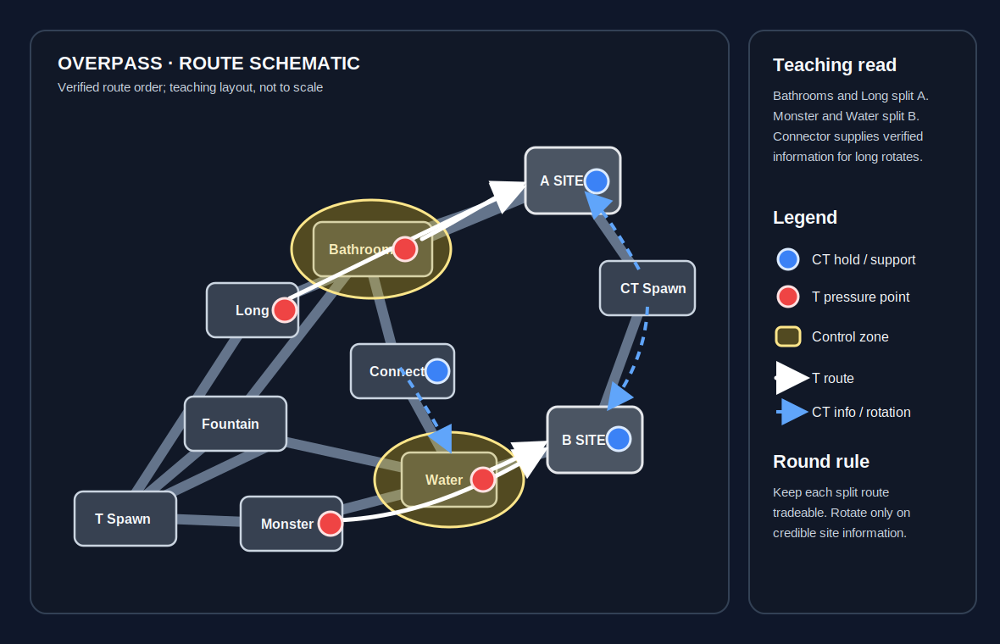

# Overpass

**Pool:** Competitive-only  
**Mode:** Defusal  
**Key lesson:** Bathrooms/Connector control, Water pressure, and long rotations

[Visual/source note](assets/map-overview-source.md)

## Positioning visual

[Positioning source note](assets/map-overview-source.md) · [Visual utility cards](utility.md#visual-lineups)

1. Starting roles: Ts keep a Bathrooms pair, a Long player, a Monster/Water pair, and a flexible bomb carrier; CTs preserve A and B anchors with one Connector-aware rotator.
2. Information trigger: Bathrooms control enables the Long split toward A, while confirmed Monster plus Water space enables the two-lane B hit without asking either entry to fight alone.
3. Rotation/trade path: Bathrooms and Long remain separate A approaches, Monster and Water remain separate B approaches, and Connector is an information and rotation route rather than a substitute for verified site contact.

## How to use this folder

- [Offense plan](offense.md)
- [Defense plan](defense.md)
- [Utility priorities](utility.md)
- [Visual utility cards](utility.md#visual-lineups)

## Win condition

Use Bathrooms or Connector to connect A pressure with a late B threat and keep rotations honest.

## Learn first

1. Learn common callouts and safe routes.
2. Play the default for five rounds before changing it.
3. Practice the utility targets with a teammate.
4. Review one spacing or timing error after the match.
