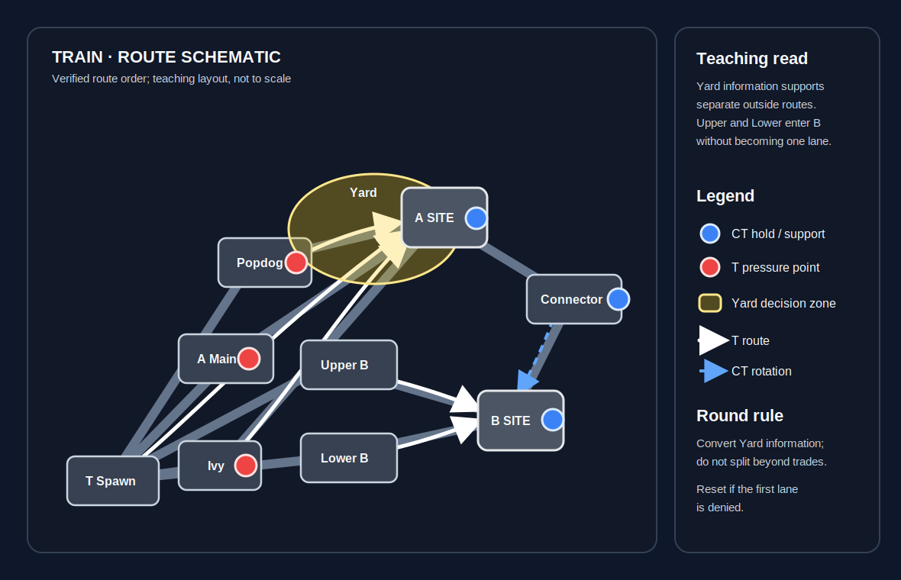

# Train

**Pool:** Competitive-only  
**Mode:** Defusal  
**Key lesson:** Yard control, ladders, and upper/lower site information

[Visual/source note](assets/map-overview-source.md)

## Positioning visual

[Positioning source note](assets/map-overview-source.md) · [Visual utility cards](utility.md#visual-lineups)

1. Starting roles: Ts keep a Yard pair, one Ivy or Popdog threat, one B Halls player, and a flexible bomb carrier; CTs preserve an outside anchor, an inner anchor, and a Connector rotator.
2. Information trigger: controlled Yard space opens the A Main, Ivy, or Popdog split decision, while confirmed Upper or Lower B contact is the signal to keep the inner pair tradeable.
3. Rotation/trade path: the arrows keep A Main, Ivy, and Popdog as separate outside approaches, keep Upper and Lower as separate B entries, and reserve Connector for verified defensive help rather than a blind chase.

## How to use this folder

- [Offense plan](offense.md)
- [Defense plan](defense.md)
- [Utility priorities](utility.md)
- [Visual utility cards](utility.md#visual-lineups)

## Win condition

Turn Yard information into a clear upper/lower commitment instead of disconnected fights around trains.

## Learn first

1. Learn common callouts and safe routes.
2. Play the default for five rounds before changing it.
3. Practice the utility targets with a teammate.
4. Review one spacing or timing error after the match.
