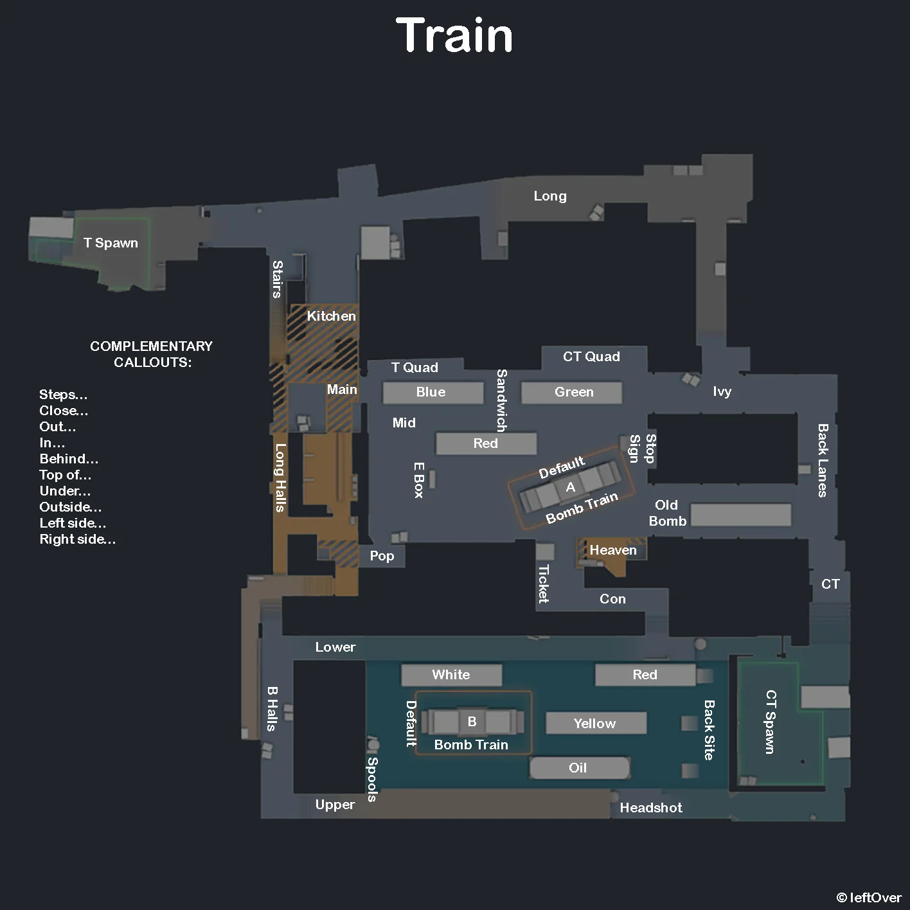

# Train

**Pool:** Competitive-only  
**Mode:** Defusal  
**Key lesson:** Yard control, ladders, and upper/lower site information

[Visual/source note](assets/map-overview-source.md)

## How to use this folder

- [Offense plan](offense.md)
- [Defense plan](defense.md)
- [Utility priorities](utility.md)
- [Visual utility cards](utility.md#visual-lineups)

## Win condition

Turn Yard information into a clear upper/lower commitment instead of disconnected fights around trains.

## Learn first

1. Learn common callouts and safe routes.
2. Play the default for five rounds before changing it.
3. Practice the utility targets with a teammate.
4. Review one spacing or timing error after the match.
