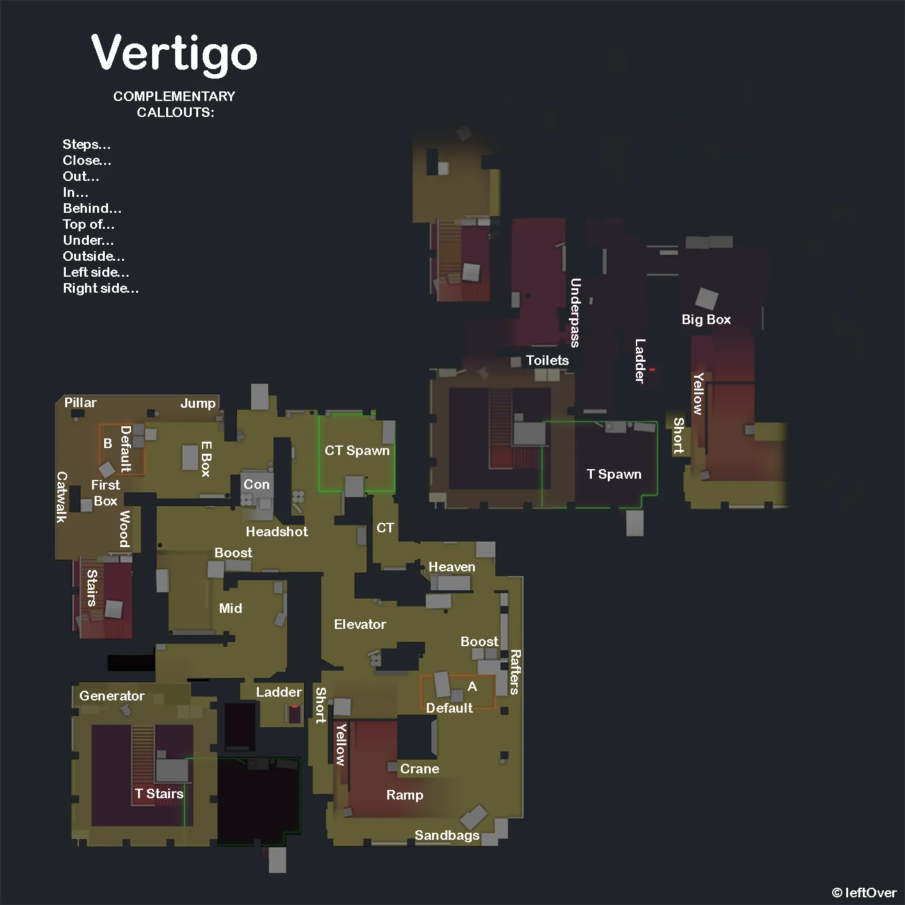
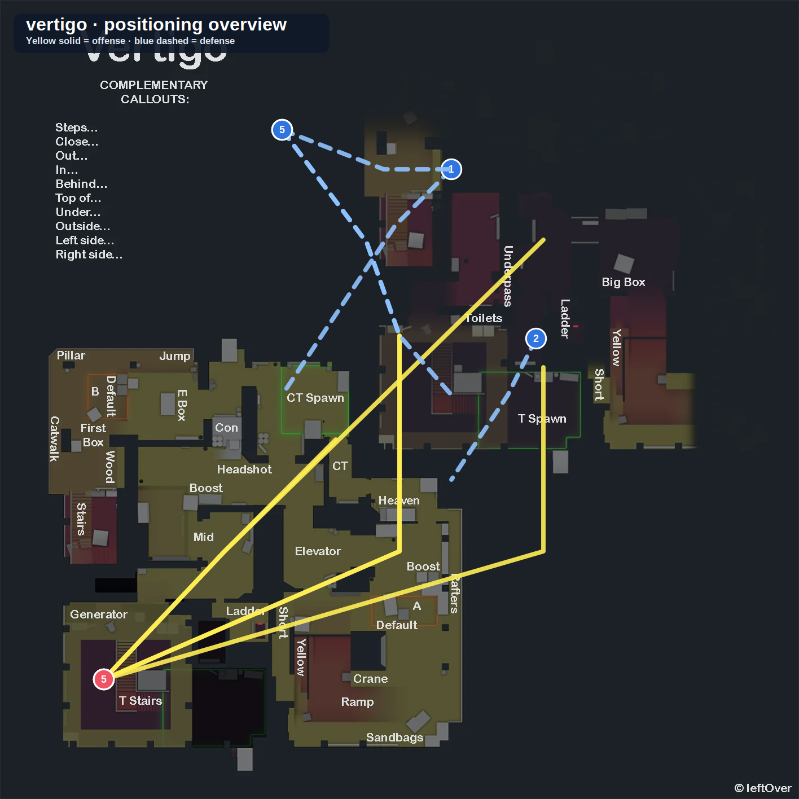

# Vertigo

**Pool:** Competitive-only  
**Mode:** Defusal  
**Key lesson:** Ramp control, exposed spacing, and disciplined rotations

[Visual/source note](assets/map-overview-source.md)

## Positioning visual

[Positioning source note](assets/map-overview-source.md) · [Visual utility cards](utility.md#visual-lineups)

1. Starting roles: Ts keep a trade pair at A Ramp, one Mid/Connector player, one B Stairs threat, and one flexible bomb carrier; CTs keep the A Ramp hold tradeable without abandoning B information.
2. Information trigger: secured Ramp space opens the A scale, while confirmed Mid/Connector control can pull the B helper and create the opposite-site timing.
3. Rotation/trade path: dashed arrows mark the route-sensitive climbs from A Ramp to A and B Stairs to B; defenders rotate only on confirmed contact so one distant smoke does not empty a floor.

## How to use this folder

- [Offense plan](offense.md)
- [Defense plan](defense.md)
- [Utility priorities](utility.md)
- [Visual utility cards](utility.md#visual-lineups)

## Win condition

Treat Ramp as a team space problem: take it together, clear it with utility, and avoid isolated swings.

## Learn first

1. Learn common callouts and safe routes.
2. Play the default for five rounds before changing it.
3. Practice the utility targets with a teammate.
4. Review one spacing or timing error after the match.
